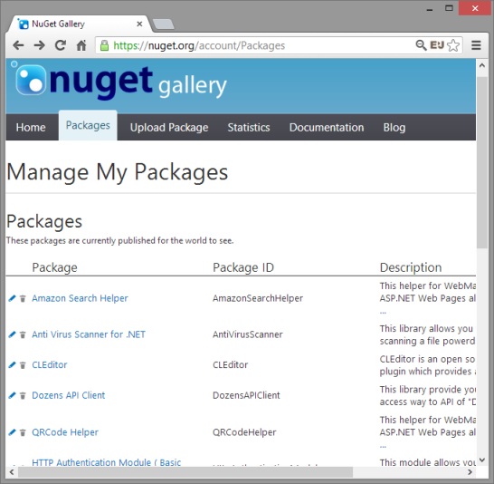
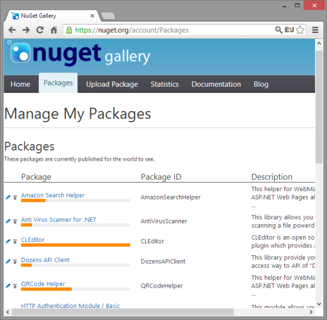

# Visualize NuGet My Packages Download Count

## What this? / これは何?

This is a JavaScript which designed to inject to NuGet ["Manage My Packages" page](https://nuget.org/account/Packages).  
This JavaScript visualize NuGet packages download count by bar chart.

これは NuGet ["Manage My Packages" ページ](https://nuget.org/account/Packages) に注入するように作成された JavaScript です。  
 この JavaScript は NuGet パッケージのダウンロード数をバーチャートによって可視化します。

### Before

### After this script injected

 

## How to use? / 使い方

Open the NuGet ["Manage My Packages" page](https://nuget.org/account/Packages), and enter follow text into address bar of the browser.

NuGet ["Manage My Packages" ページ](https://nuget.org/account/Packages) を開き、次にブラウザのアドレスバーに以下のテキストを入力します。

    javascript:(function(d){var s=d.createElement('script');s.type='text/javascript';s.src='https://goo.gl/5GS0L';d.body.appendChild(s);})(document)

Then, appear prompt dialog to skip top downloads packages.  
You reply to the prompt then appear bar charts under package name.

You can save the above code to browser bookmark as a "Bookmarklet".

すると上位ダウンロード数のパッケージを飛ばすプロンプトが現れます。  
このプロンプトに応答すると、パッケージ名の下にバーチャートが現れます。

上記コードを "ブックマークレット" としてブラウザのブックマークに保存しておくことができます。
